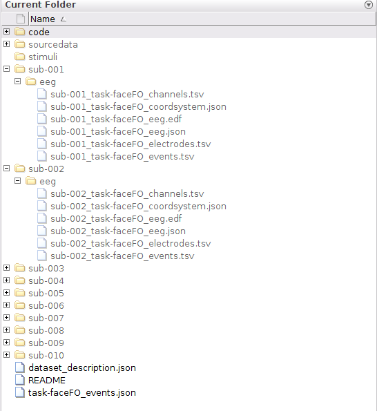
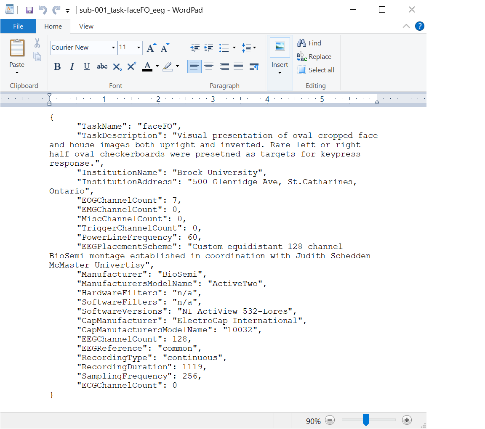
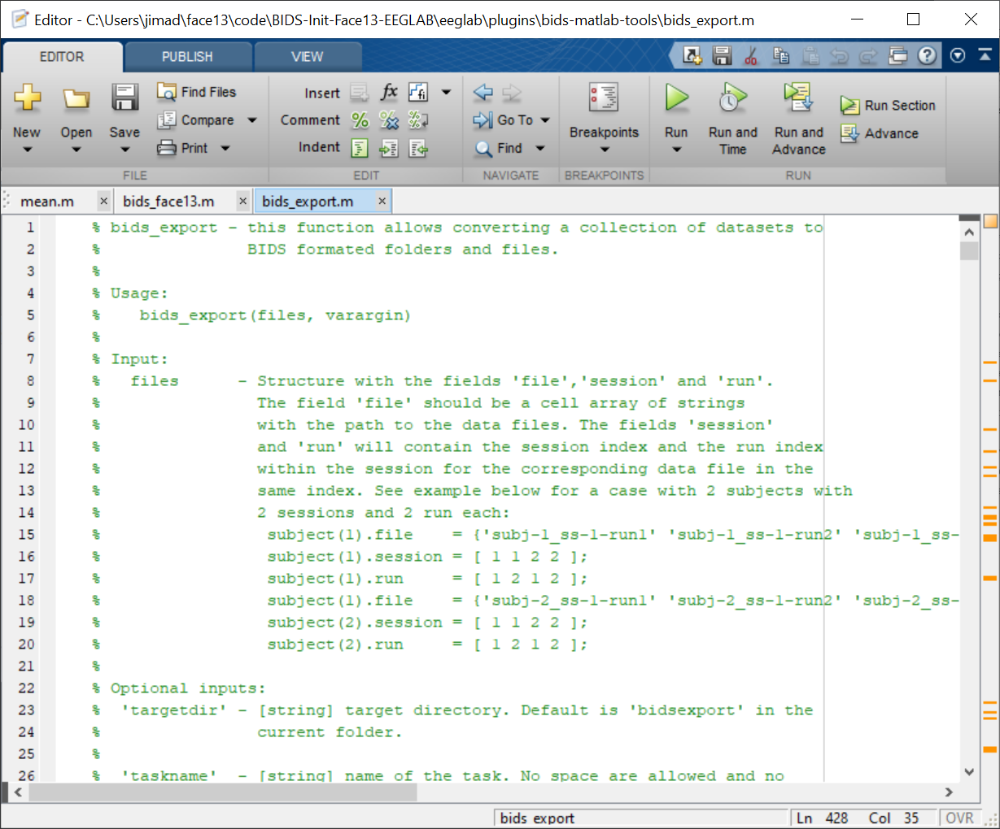

::::::::::::::::::::::::::::::::::::::: objectives

- Understand how to initialize your data into BIDS.

::::::::::::::::::::::::::::::::::::::::::::::::::

:::::::::::::::::::::::::::::::::::::::: questions

- How do I get my data into a BIDS compliant folder structure?
- What does a BIDS folder structure look like?

::::::::::::::::::::::::::::::::::::::::::::::::::

## Creating a BIDS folder structure

Initializing data into a BIDS compliant folder structure will result in individual subject folders that contain an `eeg` folder.  All of the EEG files for that participant will be stored within `sub-*/eeg/` folders.

To make the data compliant with BIDS, run the `bids_face13.m` script in the Matlab Command Window:

```matlab
>> bids_face13
```

A file chooser window will pop up when running the `bids_face13.m` script. This file chooser is asking where you want the `sub-*/eeg` folders to be created. Select the **project directory** (Face13 folder) with the file chooser.

Creating the `sub-*/eeg/` folders in the root of your project directory will create a folder structure that looks like this:

{alt='BIDS Folder Structure'}

Several files will be produced within each `sub-*/eeg/` folder. All of the file names contain the subject number as well as the task name and a suffix to denote the information that is saved within that file. For example, the EEG recording data files have a suffix of `_eeg` and are saved as .edf files.

Once this procedure is completed, your initialized data will be in the BIDS standard (`sub-*/eeg/`) in the root of your project folder.

#### **Exploring the formatted text files with the participant folders**

Now that the data sessions are BIDS compliant many of the data parameters are available within formatted text files. This makes it easy to explore the session parameters using a folder browser and simple text editor. Note that this also makes it very efficient for tools and platform to access relevant session parameters without having to read the large data files.

{alt='BIDS EEG tsv'}

#### **Digging down into the "BIDSification" process**

The scripts used in this workshop use a forked version of the [bids\_matlab\_tools EEGLAB plugin](https://github.com/sccn/bids-matlab-tools). We can explore the specifics of the process by examining the "bids\_face13" script provided for this lesson.

```matlab
>> edit bids_face13
```

{alt='Edit bids\_face13'}

The bids\_export function is the tool that does the BIDS compliant data writing of an EEGLAB EEG data structure. Looking through this function provides the information about what inputs are required to generate the BIDS compliant data set, as well as what options are available to modify the output.

```matlab
>> edit bids_export
```

{alt='Edit bids\_export'}

#### **Next steps**

Once the data are BIDS compliant, you are now ready to begin working with the data in the [Processing data with EEGLAB tutorial](https://carpentries-incubator.github.io/SDC-EEGLAB/).


:::::::::::::::::::::::::::::::::::::::: keypoints

- Now the data are initialized into the BIDS standard

::::::::::::::::::::::::::::::::::::::::::::::::::


