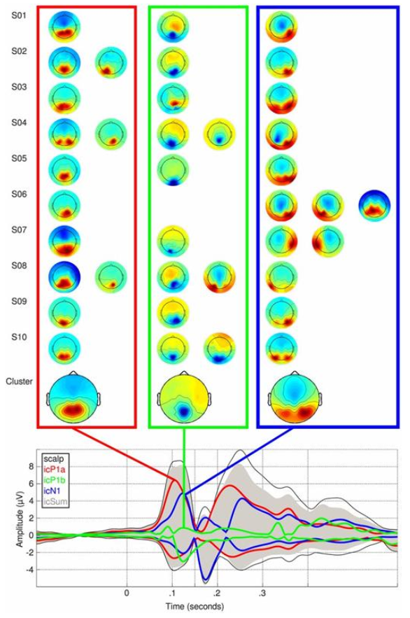
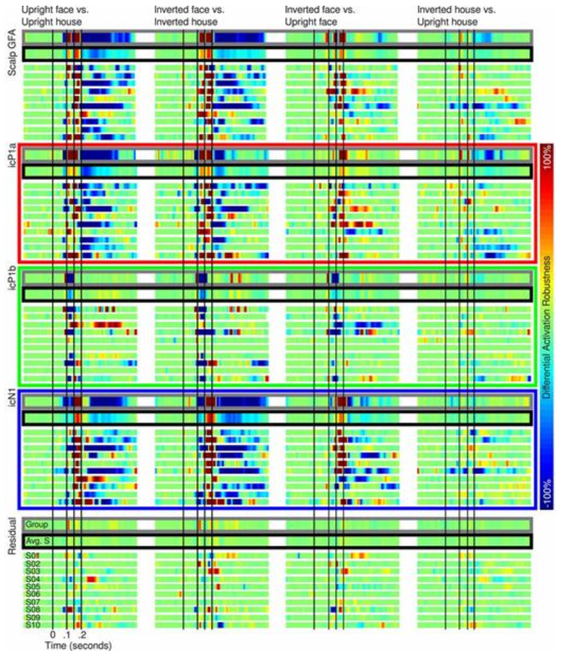
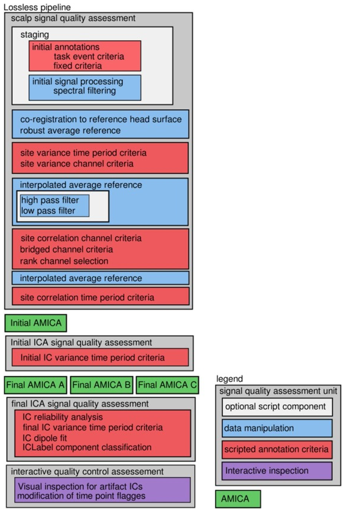
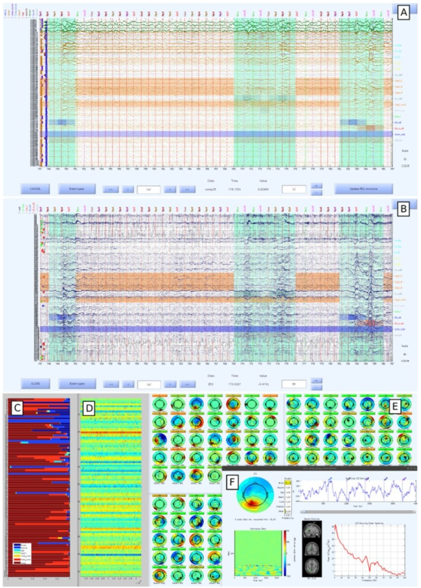
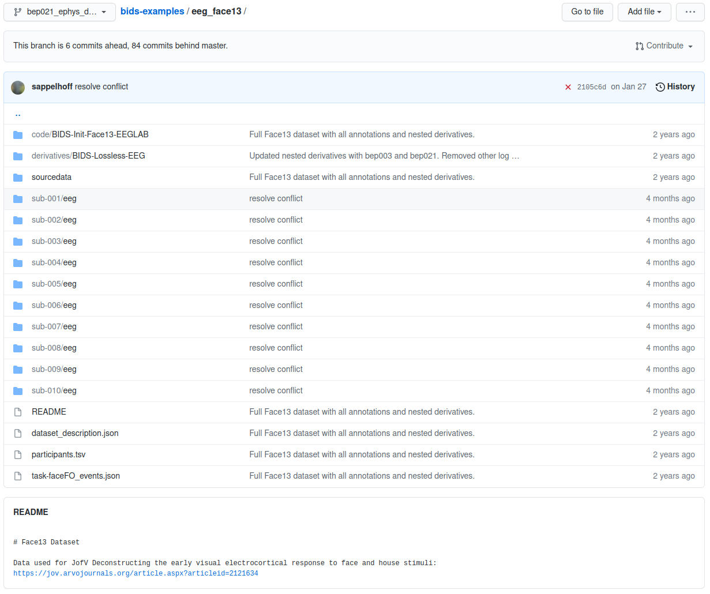
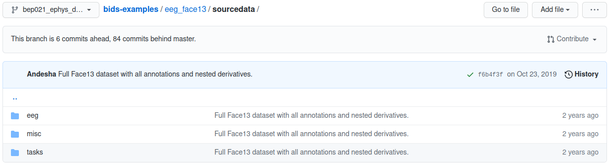
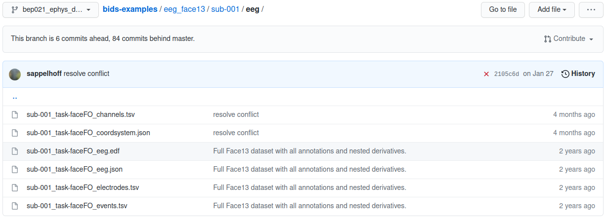
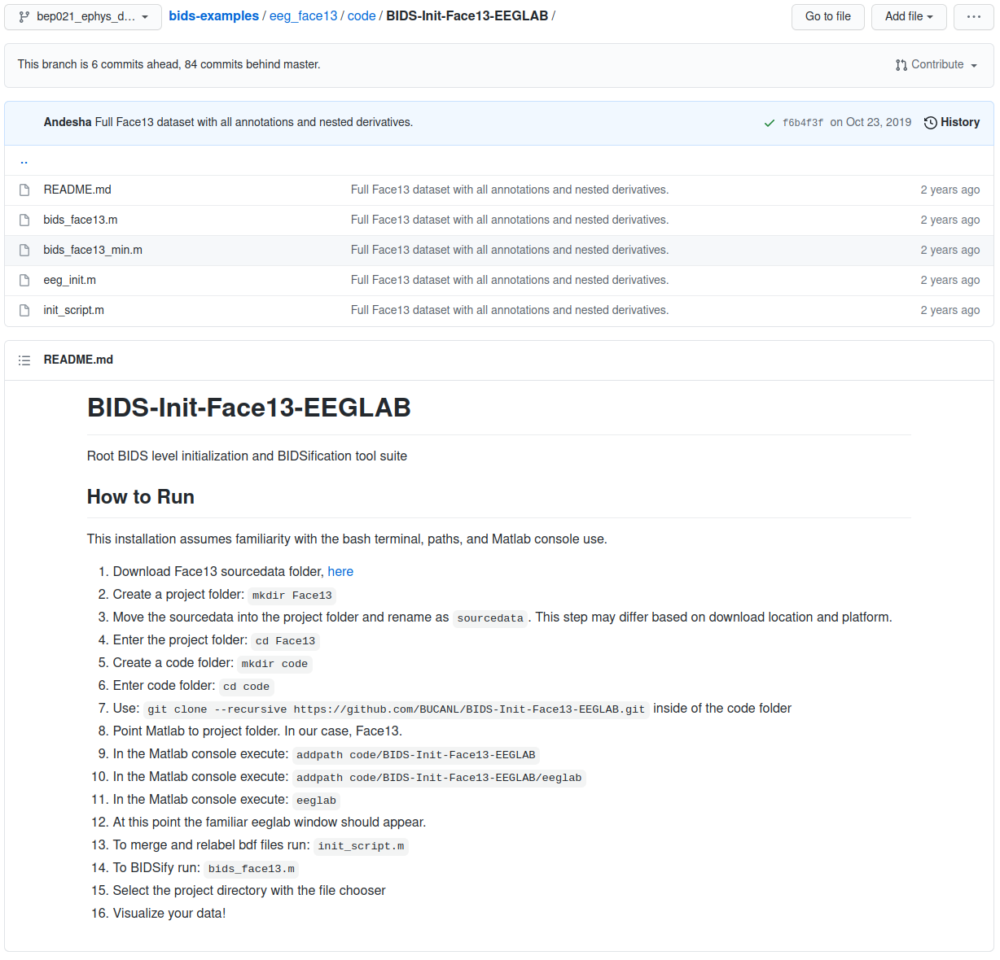
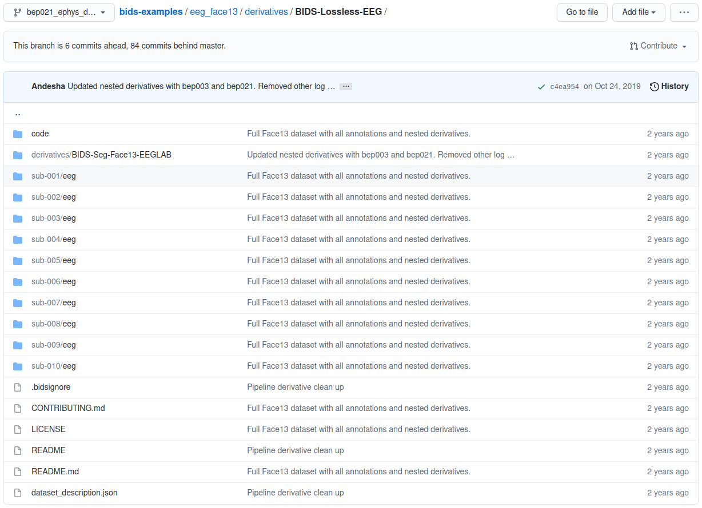
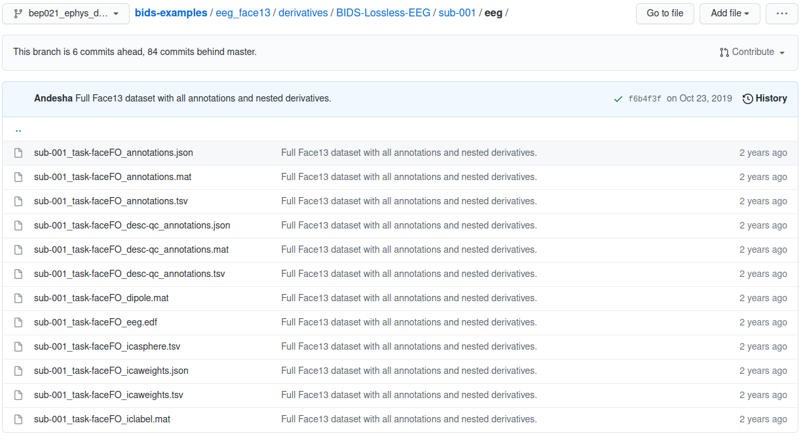

::::::::::::::::::::::::::::::::::::::: objectives

- Understand the value of using data standards in research
- Understand the complexities of establishing a standard for EEG data

::::::::::::::::::::::::::::::::::::::::::::::::::

:::::::::::::::::::::::::::::::::::::::: questions

- Why are data standards important?
- What information needs to be standardized for EEG?

::::::::::::::::::::::::::::::::::::::::::::::::::

## The big picture of EEG data standards

#### **EEG data is complicated and with many properties that can be stored in an infinite number of ways**

In order to work with EEG data, the researcher needs to work with several properties of the data. These properties include things like the voltage signals that are sampled at a specific rate, the physical locations of the recording sites, as well as more idiosyncratic properties like the experimental task event marks, etc. When building a lab or planning a new study decisions are made about all of the EEG properties and those properties make up the interpretable material of the research project. Decisions are also made about how all of that information is going to be stored and managed so that it can be found and used by the researcher and software tools later.

#### **When a researcher is making decisions about EEG parameters and data management strategy for a lab or project some of the questions they might ask are:**

1- How should the information be stored so that it can be used efficiently now?

2- How should the information be stored so that it can be used efficiently later?

3- Could the data be efficiently shared with another research group?

4- Could another group or project's data be used or integrated (pooled)?

5- Can the data be made open access and available long-term?

6- Are there existing analytic tools, procedures or platforms to which the data need to be compliant?

7- What are the costs now (and later) for designing a new unique data storage strategy?

#### **Can a data standard provide answers to these questions?**

1- It is always a concern that something important will be missed when designing a data management strategy, a clear community driven discussion about adaptive best practices is an ideal way to build confidence in decisions.

2- The best way to keep data valuable in the long term is to have sufficient documentation that is accessible (both findable and interpretable) to not only yourself, but also to others in the future. A published standard offers this documentation, not to mention various other resources (such as workshops like this one).

3- When sharing data that is compliant with a data standard the recipient only needs to become familiar with the standard in order to access the relevant properties and parameters of the research data.

4- Independent datasets that share compliance with a data standard can easily be pooled in terms of their data management strategy and access methods. Variance in project parameters still need to be addressed in the analytic process but those parameters can be accessed in a common way.

5- Open-access data curation platforms are the ideal place to make a data project openly available over the long term. Compliance with a data standard greatly facilitates the ingestion of data into databases or platforms.

6- Software and platform development often requires substantial effort to account for input and output diversity (or it is constrained to a subset of data types). If a data standard has substantial uptake it is an ideal place for analytic tool developers to focus their attention.

7- People's time in a research project is an important consideration and the time spent on designing a data management strategy can vary greatly. It is also important to note that a unique data management strategy can have unexpected costs in the future. An established data standard has had the opportunity to collect experience from across the research community over several generations of projects.

## **The face13 data set**

The example data set used in this lesson is the sample used in the 2013 paper ["Deconstructing the early visual electrocortical responses to face and house stimuli"](https://jov.arvojournals.org/article.aspx?articleid=2121634) by James Desjardins and Sid Segalowitz. The goal of the paper was to untangle the underlying cortical sources of the P100 and N170 ERP face effect complex using independent component analysis (ICA). Because ERP face effects have been reported at various times during the P100 and N170 ERP complex, the goal was to determine which underlying sources account for effects at the scalp over the ERP period.

{alt='face13 ICA decomposition'}

Because the reliability of some of the P100 and N170 complex ERP effects varied in the literature the statistical analysis of this paper not only looked for ERP differences but used robust bootstrapping measures to assess the replicability of the ERP differences over the period of the P100 and N170 ERP complex.

{alt='face13 DAR decomposition'}

## **The EEG-IP-L (EEG Integrated Platform Lossless) processing pipeline**

The preprocessing methods used in this paper to objectively produce robust ICA decomposition in an automated way eventually evolved into the ["EEG Integrated Platform Lossless (EEG-IP-L) pre-processing pipeline for objective signal quality assessment incorporating data annotation and blind source separation"](https://www.sciencedirect.com/science/article/pii/S0165027020303848)(Desjardins et al. 2021, Journal of Neuroscience Methods).

{alt='EEG-IP-L diagram'}

The method also includes an interactive quality control method in which the researcher assesses and potentially modifies various signal quality annotations.

{alt='EEG-IP-L dashboard'}

## **EEG-BIDS examples: face13 data and the EEG-IP-L derivative**

#### **BIDS home page and publications**

The [Brain Imaging Data Structure](https://bids.neuroimaging.io/) (BIDS) is a standard for organizing the content of various neuroimaging modalities (MRI, MEG, EEG). ["The brain imaging data structure, a format for organizing and describing outputs of neuroimaging experiments"](https://www.nature.com/articles/sdata201644) was published in 2016 by Gorgolewski et al. ["EEG-BIDS, an extension to the brain imaging data structure for electroencephalography"](https://www.nature.com/articles/s41597-019-0104-8) was published in 2019 by Pernet et al.

#### **BIDS starter kit repository**

The BIDS standard starter kit can be found at github [here](https://github.com/bids-standard/bids-starter-kit).

#### **BIDS examples repository**

The standard is actively discussed and evolving to adopt new features. You can find the face13 data set among the bids-examples at github [here](https://github.com/bids-standard/bids-examples).

Navigating the example data sets provides not only a demonstration of the data organization but also the diversity that the standard enables.

#### **eeg\_face13 example**

The [eeg\_face13 examples data set](https://github.com/bids-standard/bids-examples/tree/bep021_ephys_derivatives/eeg_face13) not only demonstrates the layout of the raw sample data in the standard but also contains an example of storing the output of the EEG-IP-L pipeline as a derivative state of the sample.

#### **eeg\_face13 example root folder**

The root folder of the project's BIDS structure contains high level project information and a directory for each participant.

{alt='BIDS examples root'}

#### **eeg\_face13 example sourcedata folder**

Although the raw data are stored in specified formats, the original native files acquired in the lab hardware can always remain in the sourcdata folder unmodified.

{alt='BIDS examples source'}

#### **eeg\_face13 example participant folder**

Each participant's folder contains an EDF file for the EEG signals and then several formatted text files containing the details of specific session properties such as channel locations and event markers.

{alt='BIDS examples raw'}

#### **eeg\_face13 example code folder**

The software tools and scripts used to transform the data are an important part of being able to work with (and interpret) the data long term. This is not to mention the importance of storing code with the data for reasons of replication. The code folder of the BIDS standard is where all of the relevant procedures are stored.

{alt='BIDS examples code'}

#### **eeg\_face13 example derivatives folder**

The project's root folder can also contain derivatives for subsequent states of the processed data.

{alt='BIDS examples derivative'}

#### **eeg\_face13 example derivative participant folder**

A derivative folder matches the organization of the project's root folder, but its contents are a transformation of the parent directory. Derivative folders themselves can contain derivatives folders recursively as data states are transformed into subsequent data states.

{alt='BIDS examples derivative'}

:::::::::::::::::::::::::::::::::::::::: keypoints

- What does it take to standardize an EEG project?
- What is gained by standardizing an EEG project?

::::::::::::::::::::::::::::::::::::::::::::::::::

