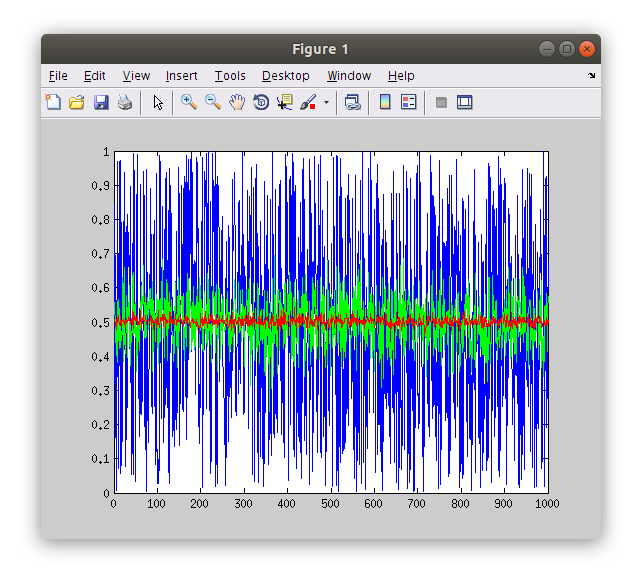
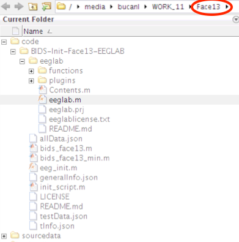
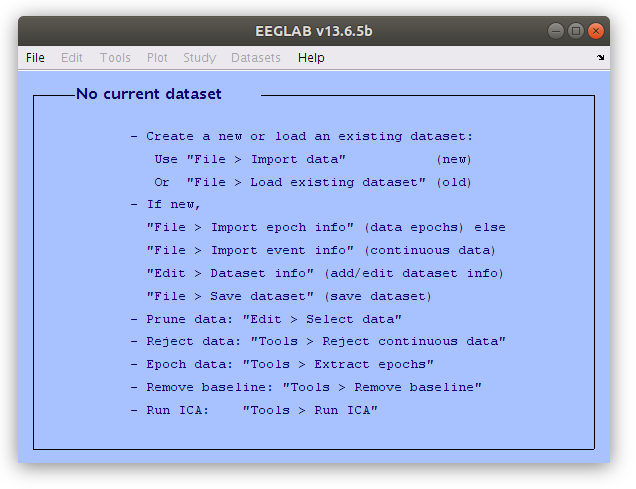
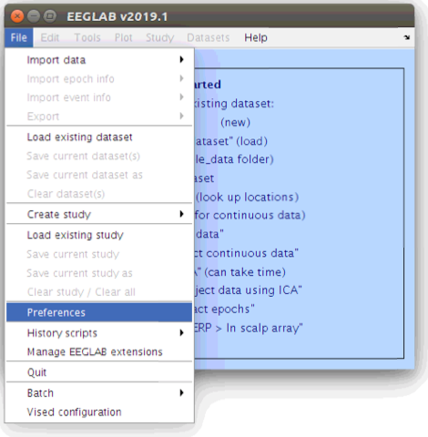
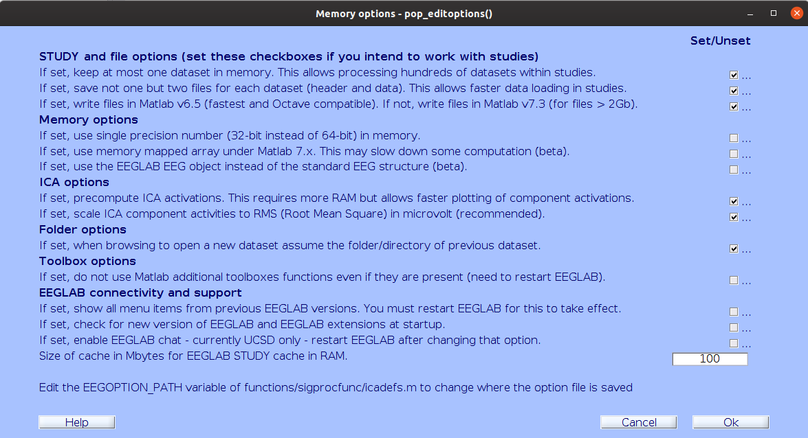

::::::::::::::::::::::::::::::::::::::: objectives

- Understand what EEGLAB needs to be able to find (data and scripts) and how to tell it where to find them.

::::::::::::::::::::::::::::::::::::::::::::::::::

:::::::::::::::::::::::::::::::::::::::: questions

- What does EEGLAB need to know about the folder structures?
- How to set up the paths in Matlab for EEGLAB

::::::::::::::::::::::::::::::::::::::::::::::::::

## What does Matlab need to know about the folder structure in order to run EEGLAB?

#### **EEGLAB is a set of Matlab functions (... which are text files).**

Lets now take a look at how the functions operate in the Matlab environment. Matlab is an interpreted language. This means that it will read some text, interpret it in a very specific way and then perform the operations that are defined by the text.

For our purposes we can think of Matlab doing two very important things:

1. It stores information in memory as different kinds of variables
2. It can perform operations (or functions) on those variables

Lets open the Matlab Integrated Development Environment (IDE) and take a look at these capabilities.

{alt='Matlab Integrated Development Environment'}

:::::::::::::::::::::::::::::::::::::::::  callout

## Anatomy of the Matlab Integrated Development Environment (IDE)

The Matlab IDE is made up of several sections in the Graphical User Interface (GUI). Each of these are important to understand as we move towards interacting with EEG data via EEGLAB.

1. Command Window: This is where we interact with Matlab using the Command Line Interface (CLI) creating variables and performing operations on them.
2. Current Folder: This is the directory that Matlab is pointing to. This is the part of the file system that Matlab sees and is its starting point for relative paths.
3. Workspace: this is a summary of the variables that are accessible to the Command Window
4. Command History: This is the interactive list of operations that have been called from the Command Window.
5. Editor: This is a text editor with added features for modifying Matlab interpreted text files (\*.m files).

::::::::::::::::::::::::::::::::::::::::::::::::::

#### **Creating variables in the Matlab CLI**

Making new variables (or modifying existing variables) is accomplished using the "=" character.

We can create a new variable named "x" and make it equal to a series of numbers:

```source
x=[1,2,3,4,5];
```

:::::::::::::::::::::::::::::::::::::::::  callout

## There are several ways to store information in the workspace

There are several types of variables in Matlab, such as the numeric array above, but there are also strings, cell arrays and structures. EEGLAB stores its information in a structure named "EEG". That is where we will find all of the EEG properties that EEGLAB has at its disposal later in this lesson.


::::::::::::::::::::::::::::::::::::::::::::::::::

#### **Performing operations on variables in the Matlab CLI**

We can also perform operations on the variable and have the result saved to a new variable "y":

```source
y=mean(x);
```

Operations can include making new figure windows and plotting variables.

```source
figure;plot(x);
```

With a few commands we can replicate the effect of calculating an Event Related Potential (ERP).
First we create a three dimensional array of random numbers. Note that segmented EEG data takes this form in EEGLAB, where rows are channels, columns are time samples and pages are epochs.

```source
y=rand(3,1000,600);
```

We can find the size of an array by calling its "size". The order of the dimensions in Matlab indexing are 1- rows, 2- columns and 3- pages.

```source
size(y)
```

#### **A random number ERP**

Next we can plot portions of the three dimensional array by indexing to y.
Then apply an average to a specified range of values along the third dimension of y (pages, or trials in EEG) before plotting it as an overlay.
Then finally average across the entire range of pages (epochs) and then overlay the result on the figure.
This example demonstrates that the more random numbers that are averaged together, the smaller the resulting mean becomes. This is a fundamental property of ERPs

```source
figure;plot(y(2,:,8));
hold on;plot(mean(y(2,:,1:16),3),'g');
hold on;plot(mean(y(2,:,:),3),'r');
```

{alt='mean figure'}

#### \**Exploring *.m files**

Note that operations in Matlab are text files that we can examine. Matlab needs to be able to see the text file (\*.m) that describes a function in its "path". We can find out where Matlab is finding a function file by querying "which [funcname]".

```source
which mean;
```

Calling the "edit" function on a function will open the \*.m file in the Matlab editor (or if it does not see the function it will request to make a new empty file of requested name).

```source
edit mean;
```

{alt='mean edit'}

#### **Starting EEGLAB**

EEGLAB is a function that is executed by Matlab. If we call it before Matlab knows where it is an error will be returned. Try calling "eeglab" in the Command Window from where you are now.

```source
eeglab;
```

In Matlab, **navigate to the `Face13` folder** that you created during the setup.

Now that Matlab is pointed to the Face13 folder we need to tell it where to find the "eeglab.m" file that we want to use for this lesson. Navigating in the Current Folder window (by expanding folders WITHOUT selecting (double clicking) them) we find the "eeglab.m" file in 'code/BIDS-Init-Face13-EEGLAB/eeglab'. We need to add this folder to Matlab's path in order to run this version of EEGLAB. We can add this folder to Matlab's path in several ways including using the "set path" button in the toolbar, but given that we are all in the same folder structure the following "addpath" calls in the Command Window should work.

{alt='eeglab path'}

:::::::::::::::::::::::::::::::::::::::::  callout

## Path for Face13 folder

It is important to ensure that `Face13` is the last folder listed in your Matlab path as this indicates that `Face13` is your current working directory. You should see the `code` and `sourcedata` folders within the Current Folder window in Matlab.

::::::::::::::::::::::::::::::::::::::::::::::::::

```source
>> addpath code/BIDS-Init-Face13-EEGLAB
>> addpath code/BIDS-Init-Face13-EEGLAB/eeglab
```

Now let's try "eeglab" again from the Command Window.

```source
eeglab
```

:::::::::::::::::::::::::::::::::::::::::  callout

## Warning: Name is nonexistent or not a directory

If when adding the paths or trying to open EEGLAB you receive a warning stating that the name is nonexistent or not a directory, ensure that you have navigated to the `Face13` folder that you made during the setup. Also make sure that the `code` and `sourcedata` folders are located within the `Face13` folder.

::::::::::::::::::::::::::::::::::::::::::::::::::

EEGLAB has a Graphical User Interface (GUI) so we will be able to do a lot of the processing by clicking in menus and interacting with figures, but we will also learn how to take advantage of EEGLAB's integration with the command line interface to work more efficiently and reliably.

{alt='eeglab gui'}

#### **Setting some EEGLAB options so it behaves similarly for everyone**

Now that we all have EEGLAB running in Matlab on our computers let's set a couple options to make sure that the software behaves similarly for all of us. Select "Preferences" from the EEGLAB "File" menu and adjust the settings as illustrated below.

{alt='memory options menu'}

{alt='memory options gui'}


:::::::::::::::::::::::::::::::::::::::: keypoints

- Working with EEGLAB requires that specific files can be found in specific locations

::::::::::::::::::::::::::::::::::::::::::::::::::


